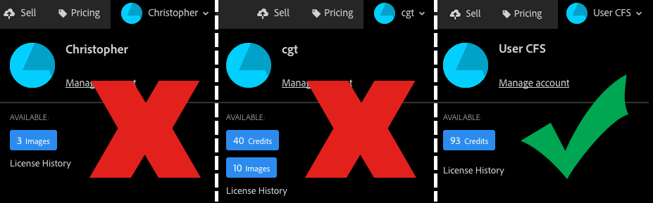

<!-- omit in toc -->
# Stock API FAQ

A list of technical frequently asked questions. Don't see your question answered here? Email us at stockapis@adobe.com.

If you are looking for the Stock API Business FAQ, it is [located here](../supplemental/stock-api-business-faq.md).

- [General](#general)
    - [What thumbnail preview sizes are available?](#what-thumbnail-preview-sizes-are-available)
    - [Why are there more search results returned than the 'limit' value?](#why-are-there-more-search-results-returned-than-the-limit-value)
    - [Why don't all assets show up in Search API results?](#why-dont-all-assets-show-up-in-search-api-results)
- [Downloading](#downloading)
    - [How do I download a comp image?](#how-do-i-download-a-comp-image)
    - [How do I bulk download all of my license history?](#how-do-i-bulk-download-all-of-my-license-history)
    - [Why can't I download an asset from license history?](#why-cant-i-download-an-asset-from-license-history)
- [Enterprise licensing](#enterprise-licensing)
    - [How do I add license references?](#how-do-i-add-license-references)
    - [Why do I get an error when sending the JWT?](#why-do-i-get-an-error-when-sending-the-jwt)
- [Print on Demand (POD)](#print-on-demand-pod)
    - [How do you license assets more than once?](#how-do-you-license-assets-more-than-once)
    - [Why do I see Premium and Video in my search results if I don't have credits?](#why-do-i-see-premium-and-video-in-my-search-results-if-i-dont-have-credits)
    - [How do I filter out Premium content?](#how-do-i-filter-out-premium-content)
    - [How do I filter for high-resolution images only?](#how-do-i-filter-for-high-resolution-images-only)
    - [What type of image quota do I have?](#what-type-of-image-quota-do-i-have)
    - [How do I check if the images I am selling are still available on Stock?](#how-do-i-check-if-the-images-i-am-selling-are-still-available-on-stock)
    - [How do I filter out Free content?](#how-do-i-filter-out-free-content)

<a id="general"></a>
## General

<a id="what-thumbnail-preview-sizes-are-available"></a>
### What thumbnail preview sizes are available?

<ul>
<li><code>110</code>: Small (110 px)
<li><code>160</code>: Medium (160 px)
<li><code>240</code>: Large (240 px)
<li><code>500</code>: Extra large (XL) (500 px). Returned with watermark. (default)
<li><code>1000</code>: Extra-extra large (XXL) (1000 px). Returned with watermark.</li>
</ul>

See the [Search API reference](api/11-search-reference.md).

<a id="why-are-there-more-search-results-returned-than-the-limit-value"></a>
### Why are there more search results returned than the 'limit' value?
In some cases, when you run a search the number of results you get back may be higher than the `search_parameters[limit]` value you set. This can throw off your pagination, especially when used with `search_parameters[offset]`.

Examples:

- Limit set to 2, but **3** results returned
    https://stock.adobe.io/Rest/Media/1/Search/Files?search_parameters[words]=Flowers&search_parameters[limit]=2&result_columns[]=id

```javascript
    "files": [
        {
            "id": 29490982
        },
        {
            "id": 206385506
        },
        {
            "id": 266351490
        }
    ]
```
- Limit set to 25, but **27** results returned
    https://stock.adobe.io/Rest/Media/1/Search/Files?search_parameters[words]=Flowers&search_parameters[limit]=25&result_columns[]=id

```javascript
    "files": [
        {
            "id": 29490982
        },
        {
            "id": 266351490
        }, //...
        /* Two extra results at bottom */
        {
            "id": 255736790
        },
        {
            "id": 238478418
        }
```

The issue is caused by extra **Premium** results being added to the search. To work around it, add this command to your search:

```
search_parameters[filters][premium] = true | false | all
```

This command is documented in the [Search API reference](api/11-search-reference.md). By setting to `true`, it will _only_ return Premium assets. Setting to `false` will exclude (remove) Premium assets from the results. And setting to `all` will show both types of assets. However, any of these values will fix the `limit` issue.

Example:
Limit set to 2, and exactly 2 results returned.
https://stock.adobe.io/Rest/Media/1/Search/Files?search_parameters[words]=Flowers&search_parameters[limit]=2&search_parameters[filters][premium]=all&result_columns[]=id

```javascript
    "files": [
        {
            "id": 29490982
        },
        {
            "id": 266351490
        }
    ]
```

### Why don't all assets show up in Search API results?

Because of because decisions, it is expected behavior that some assets will be hidden from search results. This can include:

* Editorial: https://stock.adobe.com/editorial
* Audio: https://stock.adobe.com/audio
* Free: https://stock.adobe.com/free
 
Free assets are a "rotating" collection, so an image could technically be a paid asset today (and appear in search), and become a free asset tomorrow (and be removed from search).

These assets types will be searchable from the Adobe Stock website because there is business logic in place to make sure that only authorized users or applications can interact with them--Stock partners cannot guarantee these special asset types will be handled correctly so they are blocked by default.

The Search API is the only service affected. If the goal is to retrieve metadata, then Search is not the correct method--instead apps should use the [Files API](api/19-bulk-metadata-files-reference.md). The Files API will retrieve metadata on any ID. Similarly, all the License APIs will work with these assets as well, if given a valid ID.


<a id="downloading"></a>
## Downloading

<a id="how-do-i-download-a-comp-image"></a>
### How do I download a comp image?
There are two kinds of preview images available: cached thumbnail images from the CDN, and non-cached comp images which need to be downloaded from the API. The first type of images are most common, and recommended for most applications. This is a sample URL:
[https://t4.ftcdn.net/jpg/00/84/66/63/240_F_84666330_LoeYCZ5LCobNwWePKbykqEfdQOZ6fipq.jpg](https://t4.ftcdn.net/jpg/00/84/66/63/240_F_84666330_LoeYCZ5LCobNwWePKbykqEfdQOZ6fipq.jpg)

For best performance, use this type of image when possible. In some circumstances, however, you may need the "comp" image version instead. This image requires a different workflow. First you must get the URL from the API, and then download it using the *same method to download licensed files*. For documentation on downloading files, see [Downloading licensed files](api/12-licensing-reference.md#downloading-licensed-files).

- Get comp URL from media ID using the [Files API](api/19-bulk-metadata-files-reference.md)

```http
  GET /Rest/Media/1/Files?ids=176175683&result_columns[]=comp_url HTTP/1.1
  Host: stock.adobe.io
  X-Product: MySampleApp/1.0
  x-api-key: MyApiKey
```

- Result
```json
"files": [
    {
        "comp_url": "https://stock.adobe.com/Rest/Libraries/Watermarked/Download/176175683/2"
    }
```

- HTTP request for comp image using access token as parameter

```http
GET /Rest/Libraries/Watermarked/Download/364815013/1?token=MyAccessToken HTTP/1.1
Host: stock.adobe.com
```

When downloading files from Adobe Stock, be sure to _follow redirects_. 


<a id="how-do-i-bulk-download-all-of-my-license-history"></a>
### How do I bulk download all of my license history?

To download all of your licensed images, you will need to create a script or application that performs some of the same process described in [Licensing assets and stuff](getting-started/apps/06-licensing-assets.md), but with fewer steps. In summary, your script must:

1. Get a token
2. Call Member/LicenseHistory
3. Parse and paginate the list to get the download URL for each asset
4. Perform a download with a token

Step #1 is covered in detail in [Stock API Authentication](getting-started/03-api-authentication.md) and in the individual [OAuth and Service Account workflow guides](getting-started/07-workflow-guides.md). Documentation for steps #2 and #3 are found in [Licensing assets and stuff](getting-started/apps/06-licensing-assets.md) and the [License history API reference](api/13-license-history.md). The key piece of data you will need is the `download_url` property, for example:

```javascript
    "license_date": "11/6/17, 2:54 AM",
    "download_url": "https://stock.adobe.com/Download/DownloadFileDirectly/ikMRKBPqHDrtTifHkbbxGfKhIGVQPw6y",
    "id": 112670342,
```

Note that the default behavior of the License History API is to only return the currently selected profile for the user or service account, and _not_ all license history for the organization. To return all license history, add `all=true`. Example: 
`https://stock.adobe.io/Rest/Libraries/1/Member/LicenseHistory?all=true`

For step #4, your application would use a download method (such as a `curl`) to programmatically download the file to your file system. Because the files tend to be large and this process will take a while, best practice is to download files to your desktop or locally attached storage first, and then copy them to a network or DAM (Digital Asset Management) system afterwards, to prevent issues such as broken transmissions or timeouts.

Here is an example download command using `curl`. Be sure to follow redirects (when using `curl`, use the `-L` | `--location` option)


```shell
  curl -L 'https://stock.adobe.com/Download/DownloadFileDirectly/ikMRKBPqHDrtTifHkbbxGfKhIGVQPw6y?token=AccessTokenHere' -o myFile.jpeg
```

<a id="why-cant-i-download-an-asset-from-license-history"></a>
### Why can't I download an asset from license history?

Adobe Stock provides access to millions of creative assets that have been submitted by our worldwide community of contributors as well as strategic content partners. In very rare situations, assets may be removed from our site. As a stock service provider, we are able to provide a downloadable copy of an asset only while it is active on our platform. We encourage all customers to download copies of assets as soon as they are licensed. Please note that, even if a licensed asset is removed from our site, your license is still valid in perpetuity (subject to the licensing terms) and that your License History will continue to display when the asset was licensed.

<a id="enterprise-licensing"></a>
## Enterprise licensing

<a id="how-do-i-add-license-references"></a>
### How do I add license references?
License references are extra metadata that you can add to a license record at the time you license the asset (for Enterprise customers only). They can be used to track the customer, purchase order, project code, etc., and can be made mandatory or optional. If mandatory, you _must_ include those fields when licensing the asset or you will receive an error.

There are two steps involved:
1. Get a list of required and optional fields from a Member/Profile request
2. Send a POST request to Content/License, including the fields as JSON

In step 1, you call Member/Profile as described in [Licensing assets and stuff](getting-started/apps/06-licensing-assets.md)

```http
  GET /Rest/Libraries/1/Member/Profile?content_id=172563501&license=Standard HTTP/1.1
  Host: stock.adobe.io
  X-Product: MySampleApp/1.0
  x-api-key: MyApiKey
  Authorization: Bearer MyAccessToken
```

If license references have been enabled, the response will include a `cce_agency` array. In the example below, `id:2` ("project reference") is required, while `id:4` ("client reference") is not. Therefore, you must at a minimum include a value for `id:2`.

```json
    "cce_agency": [
        {
            "id": 2,
            "text": "Enter project reference...",
            "required": true
        },
        {
            "id": 4,
            "text": "Enter client reference...",
            "required": false
        }
    ]
```

Instead of calling `GET` Content/License, your application will `POST` Content/License, and set the content type to `application/json`. The body of the message will include your license reference array as shown below.

```http
  POST /Rest/Libraries/1/Content/License?content_id=172563501 HTTP/1.1
  Host: stock.adobe.io
  Content-Type: application/json
  X-Product: MySampleApp
  x-api-key: <API KEY>
  Authorization: Bearer <TOKEN>

  {
    "cce_agency": [
      { "id": "2", "value": "Project Banana" },
      { "id": "4", "value": "King Kong Co" }
    ]
  }
```

To learn how to add or edit license reference fields, see [Edit a product profile for Adobe Stock](https://helpx.adobe.com/enterprise/using/adobe-stock-enterprise.html#CreateeditaproductprofileforAdobeStock).

<a id="why-do-i-get-an-error-when-sending-the-jwt"></a>
### Why do I get an error when sending the JWT?

Enterprise service accounts use JWT files instead of OAuth logins to retrieve access tokens. Occasionally, there will be errors in the workflow, often because the fields in the JWT do not match the fields in Adobe I/O. For a list of error codes, see [JWT authentication](https://www.adobe.io/authentication/auth-methods.html#!AdobeDocs/adobeio-auth/master/JWT/JWT.md).

However, if your JWT is working one day and suddenly fails the next, the most likely cause is that your public key certificate _has expired_. If it has, all you need to do is create a new one and upload to Adobe I/O on the same integration page. Nothing will need to change in your configuration, except make sure you are pointing to the correct private key file. See page 4 of the [Enterprise service account](https://www.adobe.io/content/dam/udp/assets/StockAPI/Service-Account-API-workflow.pdf) workflow guide.

Note that the sample command in the documentation sets the expiration to 365 days (1 year):
```
openssl req -x509 -sha256 -nodes -days 365 -newkey rsa:2048 -keyout myPrivate.key -out myPublic.crt
```
 
You can set the value `-days` to whatever you want.

<a id="print-on-demand"></a>
## Print on Demand (POD)

<a id="how-do-you-license-assets-more-than-once"></a>
### How do you license assets more than once?
Or, "if my contract requires me to license the same asset again, will this happen automatically in the API?"

By default, the Stock API will not license an asset again when calling the `Content/License` method. If you are required to re-license assets (for example if you are a Print on Demand customer) you must set your application to use the `license_again=true` flag. Best practice in this case is to use this flag _every time_ you license an asset, even if it has not been licensed before. The Stock API will only deduct one license from your pool of credits, even if this is the first time you are licensing this asset.

```shell
curl "https://stock.adobe.io/Rest/Libraries/1/Content/License?content_id=112670342&license=Standard&license_again=true" \
  -H "x-api-key: YourApiKeyHere" \
  -H "x-product: MySampleApp/1.0" \
  -H "authorization: Bearer AccessTokenHere"
```

If using the Stock SDK for PHP, add `license_again` to the request object.

```php
    $license_request = new LicenseRequest();
    $license_request->setLicenseState('STANDARD');
    $license_request->setContentId(112670342);
    $license_request->license_again = true;
    $adobe_stock_client = new AdobeStock($api_key, $app_name, 'PROD', $http_client);
    $license_response = $adobe_stock_client->getContentLicense($license_request, $access_token);
```

<a id="why-do-i-see-premium-and-video-in-my-search-results-if-i-dont-have-credits"></a>
### Why do I see Premium and Video in my search results if I don't have credits?
Premium assets are included in search results by default. In fact, the default API search includes _all asset types_ (except Editorial--see below). Further, to increase performance, search requests are designed to be anonymous, not requiring authentication. Therefore it is not possible for the Search API to know all your contract details and entitlements when you perform a search--this would slow down the search. Therefore, if you don't have rights to these assets and don't want to see them in search results, you will need to filter them out. See next question, below.

<a id="how-do-i-filter-out-premium-content"></a>
### How do I filter out Premium content?
The Search API includes all asset types by default, therefore you must (1) tell the API not to include Premium assets, and (2) tell it what kind of assets you _do_ want to include. Keep in mind that Video, Templates, and 3D are not considered "Premium," and therefore would still appear in the results.

The following request will exclude Premium assets (`[premium]=false`), and limit results to photos, vectors and illustrations.

```http
GET /Rest/Media/1/Search/Files?locale=en_US
&search_parameters[filters][premium]=false&search_parameters[filters][content_type:photo]=1&search_parameters[filters][content_type:illustration]=1&search_parameters[filters][content_type:vector]=1 HTTP/1.1
Host: stock.adobe.io
X-Product: MySampleApp/1.0
X-API-Key: YourApiKeyHere
```

See [Search API reference](api/11-search-reference.md).

<a id="how-do-i-filter-for-high-resolution-images-only"></a>
### How do I filter for high-resolution images only?
All Adobe Stock images _should_ be high resolution by default. Per the Stock Contributor [content requirements](https://helpx.adobe.com/stock/contributor/help/photography-illustrations.html), the minimum image resolution is 4MP (megapixels). However, if you need to guarantee a minimum resolution you can do this using three separate search filters: `area_m_pixels`, `image_width`, and `image_height`. 

All three filters accept a range of values. `area_m_pixels` only accepts values in whole _megapixels_ (millions of pixels), while `image_width` and `image_height` are measured in _pixels_. 

```
search_parameters[filters][area_m_pixels] = min int [- max int]
```

The first value is the minimum number of MPix you require, and the optional second parameter is the maximum MPix. For example, to search on images that are at least 25MPix (e.g., 5000x5000 pixels), use:

```
search_parameters[filters][area_m_pixels]=25
```

`image_width` and `image_height` operate in a similar fashion, but expect pixels instead of megapixels. Use these to require a range of pixel widths and/or heights.

```
search_parameters[filters][image_width] = min int [- max int]
search_parameters[filters][image_height] = min int [- max int]
```

Example: Minimum width of 5000 pixels
```
search_parameters[filters][image_width]=5000
```

Example: Height between 2000-4000 pixels
```
search_parameters[filters][image_height]=2000-4000
```

Example: Max height and max width of 2500 pixels
```
search_parameters[filters][image_width]=-2500&search_parameters[filters][image_height]=-2500
```


In addition, you can use the `orientation` filter to approximate an aspect ratio.

```
search_parameters[filters][orientation] = horizontal | vertical | square | all
```

In the example below, search for all photographs of hippos that have a horizontal/landscape orientation, and have a minimum pixel area of 20 megapixels. For example, this will yield images 5000x4000 or 10000x2000, but _not_ 4000x5000 or 2000x10000.

```http
GET /Rest/Media/1/Search/Files?local=en_US&search_parameters[words]=hippos& search_parameters[filters][content_type:photo]=1&search_parameters[filters][orientation]=horizontal&search_parameters[filters][area_m_pixels]=20 HTTP/1.1
Host: stock.adobe.io
X-Product: MySampleApp/1.0
X-API-Key: YourApiKeyHere
```

For more details, see [Search API reference](api/11-search-reference.md).


<a id="what-type-of-image-quota-do-i-have"></a>
### What type of image quota do I have?
This question only applies to Individual and Team customers, not to Enterprise customers.

Different types of Stock quotas are easy to distinguish in the Adobe Stock web UI, but are slightly more confusing as displayed in the Stock API. In the Stock web UI, image quota is displayed as "Images," and credit quota as "Credits."

In the examples below, user #1 has an image subscription only, user #2 has both a subscription and credit pack, and user #3 has a credit pack only.



When using the Stock API, the quota type will be returned by the [Member/Profile API](api/12-licensing-reference.md) as part of the JSON object `available_entitlement.full_entitlement_quota`.

```JavaScript
"available_entitlement": {
    "quota": 0,         <== Image subscription quota (ignore)
    "license_type_id": 1,
    "has_credit_model": false,
    "has_agency_model": false,
    "is_cce": false,
    "full_entitlement_quota": {
       ...               <== Quota types listed here (see below)
    }
},
```

Individual and Team customers can see two types of `full_entitlement_quota`:
- `image_quota`: The available images available in an image subscription.
- `individual_universal_credits_quota`: The available credits available from a credit pack.

The top-level `quota` attribute can be ignored as it only applies to image subscriptions and may be deprecated in the future.

Using the previous screenshot example, the `Member/Profile` responses would look like this when returned by the API:

**Image subscription only**
```JavaScript
"available_entitlement": {
    "quota": 3,
    "license_type_id": 1,
    "has_credit_model": false,
    "has_agency_model": false,
    "is_cce": false,
    "full_entitlement_quota": {
        "image_quota": 3
    }
},
```

**Image subscriptions + credit pack in same account**
```JavaScript
"available_entitlement": {
    "quota": 10,
    "license_type_id": 1,
    "has_credit_model": false,
    "has_agency_model": false,
    "is_cce": false,
    "full_entitlement_quota": {
        "image_quota": 10,
        "individual_universal_credits_quota": 40
    }
},
```

**Credit pack only**
```JavaScript
"available_entitlement": {
    "quota": 0,
    "license_type_id": 5,
    "has_credit_model": false,
    "has_agency_model": false,
    "is_cce": false,
    "full_entitlement_quota": {
        "individual_universal_credits_quota": 93
    }
},
```


<a id="how-do-i-check-if-the-images-i-am-selling-are-still-available-on-stock"></a>
### How do I check if the images I am selling are still available on Stock?

When curating Adobe Stock assets for sale on your print site, it is important that you incorporate a sync/update into your POD workflow so that you verify that the Stock images are still available at the time the customer is ready to order them. The simplest way to do this is to check whether the ID still exists on Stock using the [Files API](api/19-bulk-metadata-files-reference.md) for bulk metadata. For more information on why an asset might not be available, see [Why can't I download an asset from license history?](#why-cant-i-download-an-asset-from-license-history)

The Files API allows you to request up to 101 asset IDs at a time from Stock, and return any metadata associated with these assets. This can be used both to populate your image catalog with data and to verify that the images are still available.

In the example below, you supply a list of 8 asset IDs and request back the number of results and the IDs for each. While this seems redundant, it is a small and fast request which will verify if any are no longer available.
```shell
curl -X GET \
  'https://stock.adobe.io/Rest/Media/1/Files?ids=1234567,89961792,57185897,94682947,180905406,175119903,113187776,120451263&result_columns[]=id&result_columns[]=nb_results' \
  -H 'Host: stock.adobe.io' \
  -H 'X-Product: WreckBallTest/1.0' \
  -H 'cache-control: no-cache' \
  -H 'X-Product: MySampleApp/1.0' \
  -H 'x-api-key: MyApiKey'
```

When the response comes back, you can see immediately there is an issue because there are only 7 returned assets. By scanning the IDs, you can see that `1234567` is no longer available.
```javascript
{
    "nb_results": 7,
    "files": [
        {
            "id": 89961792
        },
        {
            "id": 57185897
        },
        {
            "id": 94682947
        },
        {
            "id": 180905406
        },
        {
            "id": 175119903
        },
        {
            "id": 113187776
        },
        {
            "id": 120451263
        }
    ]
}
```

### How do I filter out Free content?

Adobe Stock has recently released a [large collection of free images, vectors, and video](https://stock.adobe.com/free), which adds to its collection of free templates and 3D assets. However, these assets must be excluded from curated Print on Demand collections. 

Please also note that the Free collection can change. An image which is available today for sale could be made free in the future, and vice versa. Fortunately, the Stock API has some controls which make this easy.

1. Free content is automatically excluded from the Search API by default. For POD customers who use the Stock Search API, these new assets will not appear in regular search results. If Stock Search is exposed directly to users, they will not accidentally find any of the free content. This is by design. They can still get their own free content directly from the Stock website.

2. POD customers who do *offline* curation of Stock assets must use other methods to filter out free assets. For example, any images that are hand curated and saved in the customers database should be reviewed periodically for free content using the [**Files API**](api/19-bulk-metadata-files-reference.md).

#### Filtering free assets with the Files API
Free assets can be identified by their metadata, specifically by the `premium_level_id` field. **A value of '1' indicates a Free asset.**

<table>
  <tr>
   <td><code>premium_level_id</code>
   </td>
   <td>Asset's premium (pricing) level. Integer.
    <ul>
      <li><code>0</code>: Core/standard</li>
      <li><code>1</code>: Free &nbsp;&nbsp;<strong><== Filter on this value</strong></li>
      <li><code>2</code>: Premium level 1</li>
      <li><code>3</code>: Premium level 2</li>
      <li><code>4</code>: Premium level 3</li>
    </ul>
   </td>
  </tr>
</table>

In this workflow, a scheduled script would periodically check to see if curated assets are still available and whether their price status has changed.

For example, your website has assets #171817067 and #171817041 in its collection, both by the same artist. Adobe Stock has asked you to remove any free assets so you search for assets using the Files API. The Files API is used to check if assets are still available and to pull down any metadata needed to populate your database. In this sample URL, `premium_level_id` is one of the fields requested.

```
https://stock.adobe.io/Rest/Media/1/Files?locale=en_EN&ids=171817067,171817041
&result_columns[0]=id&result_columns[1]=title&result_columns[2]=content_type
&result_columns[3]=width&result_columns[4]=height
&result_columns[5]=premium_level_id
```

Here is the response from the API.

```
{
    "files": [
        {
            "id": 171817067,
            "title": "Cropped hand of sportsperson holding volleyball",
            "content_type": "image/jpeg",
            "width": 5760,
            "height": 3840,
            "premium_level_id": 0    /* Standard asset */
        },
        {
            "id": 171817041,
            "title": "Cropped hands of players practicing volleyball",
            "content_type": "image/jpeg",
            "width": 5760,
            "height": 3840,
            "premium_level_id": 1    /* FREE ASSET! */
        }
    ]
}
```

As shown in the response, the second asset has a `premium_level_id` of 1, which means it is a Free asset. This should be removed from the database at the next update.
