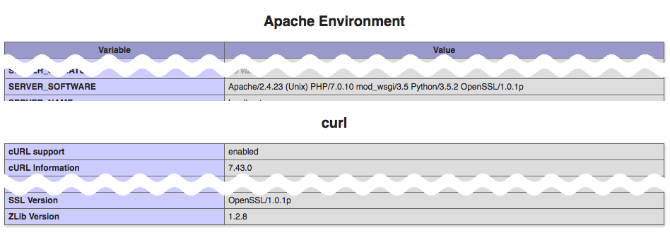

# Adobe Stock to support TLS 1.2 only

## Summary
For security and compliance reasons, Adobe Stock and Fotolia will be upgrading security on their website endpoints beginning __June 25, 2018__, with HTTP connections requiring support for TLS 1.2. After that point, lower-graded connections will be refused and will need to upgrade to get continued access.

## Why are we doing this?
The change is driven from at least three directions:
1. PCI Compliance. PCI requires support of TLS 1.1 or higher by June 30th, 2018. Very few clients support TLS 1.1 without also supporting TLS 1.2, so it makes sense to upgrade directly to TLS 1.2.
2. Fastly, the CDN supporting AdobeStock is also requiring TLS 1.2 by June 30th 2018.
3. Industry best practice. The Adobe Sign team created a great write up documenting TLS 1.2 and why we need to support it. You can read it here: https://helpx.adobe.com/sign/help/adobesign_eol_tls.html

## Who is affected?
The great majority of website users will be _unaffected_ by this change, since all major browsers have supported TLS 1.2 [since April 2016](https://en.wikipedia.org/wiki/Transport_Layer_Security#Web_browsers). Some older operating systems and browsers may be affected, however, such as Internet Explorer before version 11. Wikipedia has a [list of affected browsers](https://en.wikipedia.org/wiki/Transport_Layer_Security#Web_browsers) here.

Regarding API applications which access Adobe Stock and Fotolia services:

### Adobe Stock API
+ Stock API requests will be _mostly unaffected_, because API traffic is routed through Adobe I/O (stock.adobe.io). Currently, Adobe I/O is automatically upgrading insecure connections to TLS 1.2. This may change in the future, though.
+ Preview thumbnails _will be_ affected, as they are served from Adobe partner Fastly, and Fastly will be upgrading its servers by June 30th. 
+ Programmatic downloads will _also_ be affected, because the endpoint is on stock.adobe.com. Any files downloaded via a script or server process will need to be using TLS 1.2 after the cutoff date.

### Fotolia API
+ _100% of Fotolia API traffic will be affected_ by this change. Fotolia API traffic is routed through api.fotolia.com, which will be upgraded.

## What does this mean for you?
As mentioned above, any content which is served via a web browser should not be affected by the changes, unless your users are on a very outdated version. This includes:
+ Preview thumbnails which are displayed by the browser.
+ JavaScript Ajax requests for search results.
+ Download requests directed to the browser.

All of the above should work for the great majority of your users. In addition, any Stock API traffic that routes through Adobe I/O should also not be affected, _for now_. Adobe I/O will currently upgrade traffic to TLS 1.2, but this will change at some point in the future. Therefore, these requests should also _not_ be affected by the pending changes:
+ Search API requests to /Rest/Media/1/Search endpoints.
+ License API requests to /Rest/Libraries/1/Content and /Rest/Libraries/1/Member endpoints.

Other kinds of traffic will be affected by this change, and therefore you may need to upgrade your server-side components as detailed below. This includes:

+ Any programmatic download of assets, whether licensed original files or thumbnail previews. Adobe Stock downloads are served via stock.adobe.com (not stock.adobe.io) and therefore are not automatically upgraded to TLS 1.2.
+ As mentioned above, all Fotolia requests will require upgraded components, including search and license requests, thumbnails and downloads. 

If you try to access these resources using a non-upgraded connection, you may experience these error messages or issues:

+ "Unable to connect to the service"
+ "Service not available"
+ "Error in connection"
+ Broken image links

### Examples
Here are some sample API use cases where your application may or may not be affected by the changes.

- Search only: You use the Stock SDK for JavaScript to search Stock content, display thumbnails and redirect users to Adobe Stock to make purchases.
    + Are you affected? Probably not at all, because the browser is handling all interactions with Stock.
- Print on demand: You search content from Stock and get image metadata to populate titles and keywords. When your end users want to purchase a printable item, you license the asset from Stock and download the image to your printer.
    + Are you affected? Mostly you are not affected, because all your search and license requests are routed through stock.adobe.io. However, the download of the file is affected because it uses stock.adobe.com.
- Enterprise/DAM: Your users search on the Stock API from inside your DAM and you allow them to store their favorite assets as well as sync up license history.
    + Are you affected? Yes and no. Searching assets and getting license history data uses stock.adobe.io, so that is exempt. However, downloading assets and preview thumbnails requires access to stock.adobe.com and the Stock CDN, so those actions will require TLS 1.2.

## Do I need to upgrade?
Your server environment may already be running modern components that support TLS 1.2. Below are some methods to determine this, based on your environment.

Two of the most common connection methods by Adobe and Fotolia partners are via __OpenSSL__ and __curl__. Per this [Stack Overflow thread](https://stackoverflow.com/a/30145222)

+ TLS 1.1 and TLS 1.2 are supported since [OpenSSL 1.0.1](https://www.openssl.org/news/changelog.html#x31)
+ Forcing TLS 1.1 and 1.2 are only supported since curl [7.34.0](https://curl.haxx.se/docs/manpage.html#--tlsv12)

To check the versions of your default installations, you can use the command line:
```
$ openssl version
OpenSSL 1.0.2j  26 Sep 2016

$ curl --version
curl 7.54.0 (x86_64-apple-darwin16.0) libcurl/7.54.0 SecureTransport zlib/1.2.8
```

If you are running PHP on your server use `php_info()` to get a dump of all bundled versions of OpenSSL and curl. In the screenshots below from my local PHP server, the Apache and curl sections both show supported versions.



For Java applications, TLS 1.2 was first supported in JDK 1.7 but was not enabled by default until the March 2014 release of JDK 1.8. Therefore, we recommend upgrading at least to the latest JDK 1.8. See [JDK 8 will use TLS 1.2 as default](https://blogs.oracle.com/java-platform-group/jdk-8-will-use-tls-12-as-default).

If you use Python, [this thread explains](https://news.ycombinator.com/item?id=13539034) how to test your supported version of TLS using these links:

```
# For Python 2:
$ python -c "import json, urllib2; print json.load(urllib2.urlopen('https://www.howsmyssl.com/a/check'))['tls_version']"

# For Python 3:
$ python3 -c "import json, urllib.request; print(json.loads(urllib.request.urlopen('https://www.howsmyssl.com/a/check').read().decode('UTF-8'))['tls_version'])"
```

### If I use the Stock SDK, am I protected from this change?
No, because the SDK is only a layer on top of your web infrastructure. It is your infrastructure/server environment that must be equipped to handle this change in security policy. Users of the SDK for JavaScript are probably least affected, however if your server uses Node.js, you will need to make sure that it supports TLSv1.2 as well.

### Test URLs
Finally, you can test TLS 1.2 support on any server by appending "s" to the subdomain of any Stock or Fotolia thumbnail:

+ Stock thumbnail (non-TLS)
https://as2.ftcdn.net/jpg/00/62/81/33/500_F_62813316_QRXhuI1lWDcpQbJG2iZvDftGkOYrDAbU.jpg

  + TLS enabled
  https://as2s.ftcdn.net/jpg/00/62/81/33/500_F_62813316_QRXhuI1lWDcpQbJG2iZvDftGkOYrDAbU.jpg

+ Fotolia thumbnail (non-TLS)
https://t4.ftcdn.net/jpg/02/01/92/57/500_F_201925726_8ADIn4GCMitLJDNaqGSnzbbWrfV2LRvJ.jpg

    * TLS enabled
    https://t4s.ftcdn.net/jpg/02/01/92/57/500_F_201925726_8ADIn4GCMitLJDNaqGSnzbbWrfV2LRvJ.jpg


