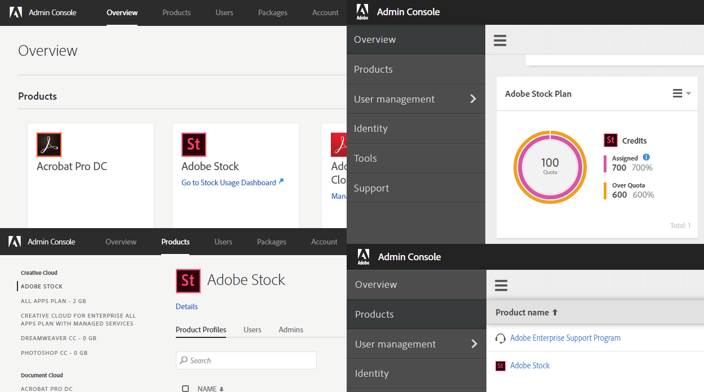

# Register your application

> _**Tl;dr version:** The Stock APIs require different forms of authentication depending on your goals. If you already know whether you need a Service Account, OAuth integration or just an API key, you may [skip ahead to register]_

#### Contents
<!-- MarkdownTOC depth=1 -->

- [Authentication overview](#authentication-overview)
- [Choose an integration type and register](#choose-an-integration-type-and-register)
- [API authentication requirements](#api-authentication-requirements)
- [Q&amp;A](#qa)

<!-- /MarkdownTOC -->

## Authentication overview

Before you can register your application, get your API key and start making requests, you will need to know:

1.  Which APIs require authentication?
2.  Which authentication method is right for your application?

Once you have answered these questions, you can visit the [Adobe I/O Console](https://console.adobe.io/) and sign up.

## Choose an integration type and register

All Adobe Stock API applications must be registered by creating an integration using the [Adobe I/O Console](https://console.adobe.io/). You will need to choose one of these integration types. After reading the descriptions, see below for a table of which business use case matches up to its respective integration.

*   **Service account.** This is the most secure authentication method, because it occurs on the backend, server-to-server, and because it requires the integrator to store a public key certificate on Adobe, and use a private key to sign requests. Adobe exchanges tokens with the application using the JSON Web Token (JWT) scheme. As a result, the application can authenticate itself without any user involvement or login.
    *   __Note:__ For Enterprise customers *only*. You will need to sign into Adobe I/O using your system admin credentials. See [Q&A](02-register-app.md#qa) below if you are unsure whether your company has Adobe Stock for Enterprise. 
    *   For a guided walkthrough, see the [Adobe Stock Service Account workflow](07-workflow-guides.md).
    *   Learn more about [Service Accounts](https://www.adobe.io/authentication/auth-methods.html#!adobeio/adobeio-documentation/master/auth/JWTAuthenticationQuickStart.md) in the Adobe Cloud Platform documentation.
    
    
*   **OAuth.** Also called [OAuth 2.0](https://oauth.net/2/), this is a web standard for allowing users to sign in directly to Adobe without sharing any credentials with the 3rd party application, and requires the user to give explicit permission to the application to access their data. Once login is complete, the application will receive an access token which can be used to make authenticated requests on behalf of the user. If you are not an Adobe Enterprise customer, then this is the only method you may use to access the Licensing API.
    *   **Special note:** In addition to creating an Adobe Stock OAuth integration, you will also need to add **Creative SDK** integration to enable the Adobe login. Because this method is more complex, refer to the [Authorization Code Workflow Guide](07-workflow-guides.md) for a complete guide.
    *   Checkout [OAuth 2.0 Playground](https://adobeioruntime.net/api/v1/web/io-solutions/adobe-oauth-playground/oauth.html) tool to genenrate an access token
    *   Find more details on [OAuth integrations](https://www.adobe.io/apis/cloudplatform/console/authentication/oauth_workflow.html) (Adobe Cloud Platform).
*   **API Key.** This is the simplest method, as all it requires is that you register your application on the Adobe I/O Console. The I/O Console will generate a Stock API key, which you will use for all subsequent requests. Note that an API key is required for *all* authentication methods, however some APIs only require the key, such as the Search API.
    *   **Note:** There is no "API Key" integration choice for Adobe Stock. Instead, choose "OAuth," and put whatever URL you want for the *Redirect URI*, because it will not be used. (*Yes*, we know this is confusing!) Here is a [screenshot](https://raw.githubusercontent.com/adobe/stock-api-docs/master/docs/images/io_api-key-integration.png) of a completed integration form on the I/O Console.
    *   For a guided walkthrough, see the [Affiliate API Workflow guide](07-workflow-guides.md).
    *   More details on [API Key integrations](https://www.adobe.io/apis/cloudplatform/console/authentication/api_key_workflow.html) (Adobe Cloud Platform). 

### Use case matrix

Based on your business case, this table shows which integration type would best apply to your application. For a description of each business case, see [What are the different use cases for the Adobe Stock API?](#what-are-the-different-use-cases-for-the-adobe-stock-api)

|| **Service Account** | **OAuth** | **API Key only** |
|----|:----:|:----:|:----:| 
| **Enterprise** | X | X[1](#note-1) |||
| **DAM** | X | X[1](#note-1) |||
| **Marketing Platforms** | X[2](#note-2) | X |||
| **POD/Retail** | X |||
| **Affiliates** ||| X |

## Note 1 
*While it is possible to use OAuth integration for Enterprise and DAM applications, you would typically not have your users sign in directly to Adobe Stock, and instead your application would manage the experience for them.*

## Note 2
*If your platform is going to let users access their own Stock accounts, then OAuth is the method of choice. Otherwise, if your platform is going to license assets and give them to your users as part of your service, then the Service Account would be appropriate.*

__>>> NEXT:__ Learn the basics of [authentication](03-api-authentication.md).

## API authentication requirements

> _To Search, perchance to License; aye, there's the rub. -- Shakespeare, sort of_

To (badly) paraphrase *Hamlet*, Adobe Stock currently offers APIs that can search, and then license (and get license info about), assets. The choice of APIs used by your application dictates what level of authentication you will need. 

Any request where the end user must be authenticated using their credentials or that of their organization, will need an **Authorization** header containing a "Bearer" token. All Licensing and License History API requests require this type of authentication, whereas in Search API requests, this is optional. Read through the cases below to determine whether you require authorized requests.

### Search API

#### Typical uses

*   Search by keywords, category, contributor, and so on
*   Search for similar image
*   Filter by type, size, premium level, and so on
*   Get thumbnail preview URLs
*   Retrieve list of categories

#### Authentication method

*   API key: Required
*   Authorization header: Optional
    *   When you access the API with just an API Key, the returned search results are generic, and do not take into account the user or organization who made the request.
    *   When you access the Search API with authorization, the Adobe Stock service returns the license state and licensed URL for each asset.

### Licensing API

#### Typical uses

*   Get number of images or credits required to license an asset
*   Get license status and available quota
*   Request a license
*   Download full asset after licensing, without watermark
*   Get license history

#### Authentication method

*   API key: Required
*   Authorization header: Required
*   Client secret: Required for some API requests

## Q&amp;A

### What if I just want to experiment with the APIs?

Cool! If you are an independent developer or student, you can follow the Affiliate workflow and sign up for an API key. If you want to also test licensing an asset, you can test it on a free asset like one of our great [Creative Cloud Stock templates](https://stock.adobe.com/templates) (not all templates are free, but many are). 

However, if you are interested in partnering with Adobe Stock and have a legitimate reason for a demo account, please [contact us](mailto:Grp-AdobeStockPartnerships@adobe.com?subject=%5BAdobe%20I%2FO%5D%20Stock%20demo%20account%20access).

### Do I have Adobe Stock for Enterprise?

If your company has signed an Enterprise Term License Agreement (ETLA) with Adobe, then congratulations! You are an Adobe Enterprise customer. However, while your company may have Enterprise entitlements to one or more solutions within the Creative Cloud, Document Cloud or Experience Cloud, if you do not have an Adobe Stock Enterprise entitlement--for example, you purchased a Team or Individual plan--then you might not fit into this use case. 

The Enterprise use case applies to Adobe customers who have an Adobe Stock ETLA, which means they see Adobe Stock as a product within their [Admin Console](https://adminconsole.adobe.com/enterprise).

Depending on the version of your console, you should see one of the two experiences, below. If you don't see Adobe Stock here, don't worry! You may still be able to take part in the Enterprise workflow, but you will need to make some adjustments.

### What are the different use cases for the Adobe Stock API?

These are the typical business scenarios for using the Stock API. See the [API Business FAQ](../../supplemental/stock-api-business-faq.md) to learn more about partnering with Adobe Stock.

*   **Enterprise.** This is a broad category that may overlap with some of the other use cases below, where Adobe Stock is used for internal applications, such as for branded websites or internal applications. When it licenses assets, they are available for the entire organization. Adobe Enterprise customers have a more secure authentication method that is only available to them. 
*   **Print on Demand (POD) &amp; Retail.** POD is a specific retail business type in which a company prints goods (could be wall art, marketing brochures, t-shirts, etc.) using artwork either created in-house or licensed Stock content. Because it is printed "on demand," print quantities are typically done in very small batches, per customer order. However, the Retail use case could also include traditional manufacturers, who may license a Stock asset and use it to mass-print hundreds of items at once. Note that a different [license type](https://stock.adobe.com/license-terms) may apply. In all cases, the retailer would have its own Stock account and need to access it for search and licensing.
*   **Digital Asset Management (DAM).** A DAM allows a company to manage all their digital assets in one, centralized location. If you are a corporation, you may want to integrate Adobe Stock within your corporate DAM, in which case the users will be employees of your company. Or you may be a DAM provider, in which case you want to create a mechanism that allows users to access their Adobe Stock accounts. Typically, once assets are licensed, you'd want to import your Stock assets back into the DAM so they can be stored, categorized and made searchable.
*   **Marketing platforms.** This category includes software providers that allow users to build and manage content before it is published to social media, email, online ads, web platforms, etc.  In addition to web-based software, it could include desktop or mobile apps that provide this service as well. The technical requirement is to allow users to sign in and access their Adobe Stock content to use within the platform.
*   **Affiliates.** This category includes website aggregators, who allow you to search on multiple stock sites at once, as well as any partner that wants to build an Adobe Stock search "widget" on their site, and direct traffic to Adobe for sales commissions. This is the simplest use case, because it only requires the Search API and not the Licensing API, as licensing would occur directly on the Adobe Stock website.

### Why do I need to add Creative SDK to my OAuth integration, and why is the API Key integration called "OAuth"?

Adobe Stock is still working through these issues with the Adobe Cloud Platform team. The API Key integration is simply mislabeled in the Adobe I/O Console, while the OAuth integration is new to Adobe Stock. Because it is still a new method, the Stock API Key integration lacks the proper scopes required by the Adobe login mechanism. However, Creative SDK does have the proper scopes, allowing the sign-in workflow to succeed.
